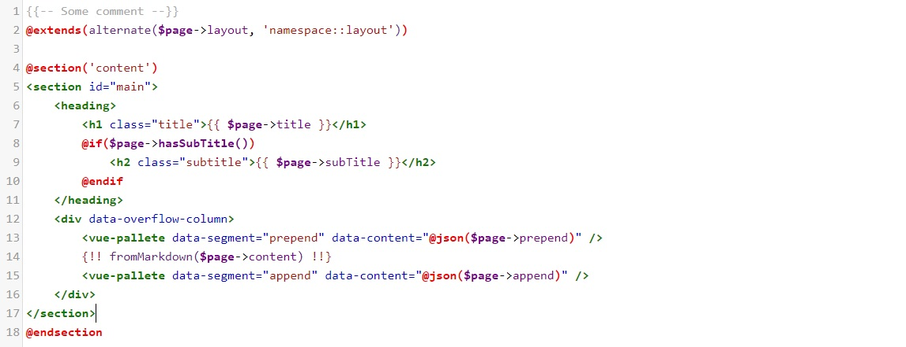

# codemirror-blade-mode
Laravel blade syntax highlight mode for codemirror library

## Base usage
```javascript
import CodeMirror from "codemirror";

import 'codemirror/mode/htmlmixed/htmlmixed';
import 'codemirror/addon/display/fullscreen';

import blade from './codemirror-blade-mode/mode.js';


blade(CodeMirror);

const editor = CodeMirror.fromTextArea(document.getElementById("editor"), {
    mode : {name: "blade", base: "htmlmixed"},
    theme: "default",
    lineNumbers: true
});
editor.on('change', () => editor.save());

```
Then you will get something like:



https://codemirror.net/LICENSE
